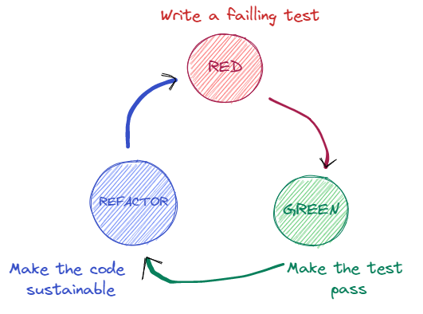

# tdd-with-spreadsheet-kata
## Goal of the session / Ice breaking
Allow people not familiar with TDD but somewhat familiar with spreadsheet to understand the concept of TDD and some other software crafting practices. These kata can be done on Excel (hint: use Tables), Google Sheets, Grist...

- What is your level in TDD (0-5) and in the chosen spreadsheet tool (0-5)?

## Concept presentation (all together)
- small explanation of the three steps of TDD (red, green, refactor)

- demo in the spreadsheet tool on the straight-forward example of computing the email adress of a new employee in a company.

From now on, the goal is to find, step by step and using TDD, the formula that calculates the bonus of an employee based on the following [rules of bonus calculation](Bonus%20calculation%20rules.md).

## Iteration 1 (small groups)

- Implement the **minimalistic** formula that works for the example given in the [documentation](Bonus%20calculation%20rules.md). Minimalistic means that it should work only for the given example. For instance, there should be no "if" in your formula.

## Iteration debrief (all together)
* A participant copilot the pilot (animator if no volunteers).
* The animator proposes some refactorings.
* We choose together the next example we want to test and that does not pass. Hint: we'll choose a simple one.

## Iteration 2 (small groups) 
* Refactor your code as proposed in the debrief.
* Try "pilot / copilot" mob programming way.
* Adapt the formula for the chosen exemple to pass.
* If you have the time to implement other cases, don't forget to breathe after the green phase in order to identify refactorings.

## Iteration debrief (all together)
* How did you choose the next case to implement?
* Did you need to introduce intermediate calculations?
* A participant copilote the pilote (animator).
* The animator proposes some refactoring.

## Iteration 3 (small groups) 
* Choose the next business rules and implement it. (Think about the usefulness of your spreadsheet. Are the inputs the ones ou think the users really have?)
* Go as far as possible in 10 min., following strict TDD

## Iteration debrief (all together)
* How did you choose the next rule to implement?
* What intermediate calculations did you introduce?
* Are you happy with the naming?
* What do you think of how the business rules are written?
* A participant copilote the pilote (animator).
* The animator proposes some refactoring.

## General debrief
- Have you learned something?

(Some ideas: [SPOIL ALERT](SPOIL%20ALERT%20-%20some%20learnings.md))
